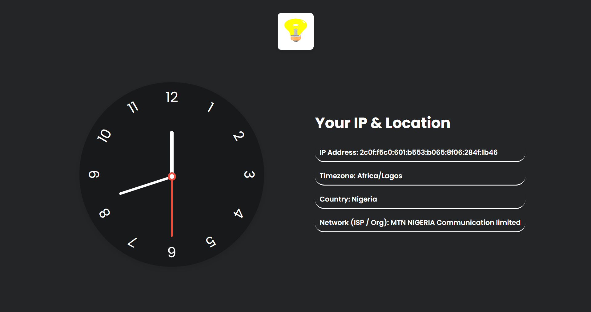

# Analog Clock with IP & Location

Hello world,  
it’s just Saturday morning — tired and waiting for the football matches early kickoff.  
Still got enough time and decided to lose it building this until the matches get started.

## Project Description
This is a small web project styled with a clean CSS theme.  
It includes:

- **Analog Clock**  
  - Built with HTML, CSS, and JavaScript.  
  - The hour, minute, and second hands are updated every second using `setInterval`.  
  - The clock hands rotate dynamically with JavaScript to reflect the current system time.  

- **IP & Location Info**  
  - Fetched from the free API: https://ipaip.com/json.  
  - Displays the client’s IP Address, Timezone, Country, and Network Provider.  

- **Dark / Light Mode**  
  - A lightbulb icon acts as a toggle switch for dark/light theme modes.

---

## Preview

---

## Tech Stack
- **HTML5**  
- **CSS3**  
- **JavaScript (ES6)**  
- **Free Geolocation API**

---

## How It Works
1. The clock is drawn using CSS for layout and styling.  
2. JavaScript calculates the degree of rotation for the hour, minute, and second hands.  
3. The rotation is updated every 1000ms (1 second) to keep time accurate.  
4. On page load, an API call retrieves and displays IP and location details.  
5. Theme toggle is handled by clicking the lightbulb icon.

---

✌️ Nothing more, just a fun small build with enough style.
